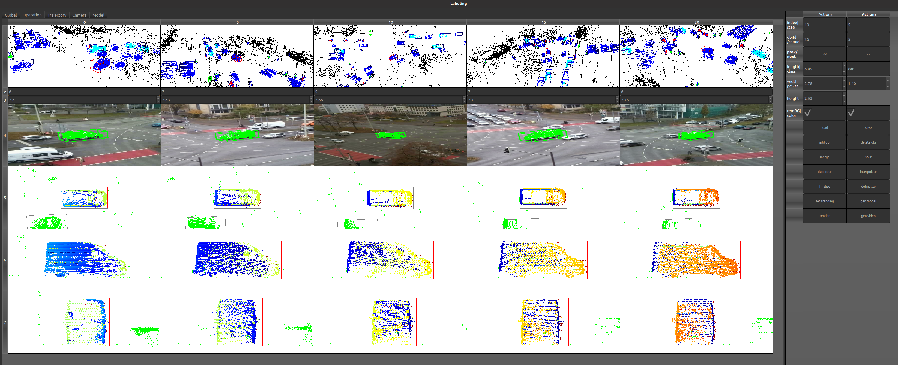
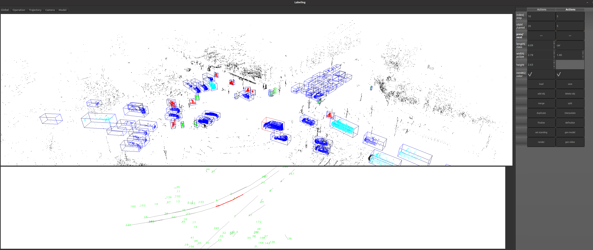
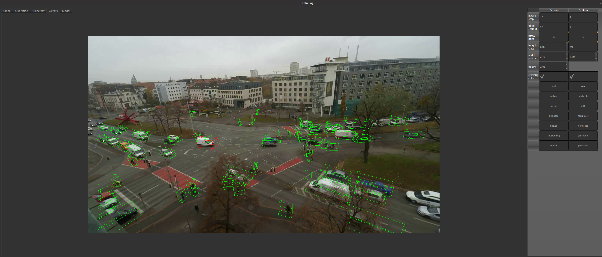

# LUMPI Labeling Tool
<span id="operatin:tab"></span>

This tool is designed to label 3D bounding boxes in a point cloud with the use of different camera perspectives.
It is configured to load the [LUMPI dataset](https://data.uni-hannover.de/en/dataset/lumpi)  and was used in the [labeling process](https://youtu.be/Ns6qsHsb06E).

## Content
- [Installation](#installation)
- [Usage](#usage)
- [Adaptation](#adaptation)
- [Development](#development)
- [License](#license)

## Installation
The tool was developed and tested with Ubuntu 20.04, and following dependencies:
- [OpenCV](https://opencv.org/)
- [Point Cloud Library](https://pointclouds.org/)
- [QT](https://www.qt.io/)

You could install all dependencies by using the requirements.txt:
```
$ xargs -a requirements.txt sudo apt-get install
```
Afterwards you could install this software by following these steps:

```
$ git clone https://github.com/St3ff3nBusch/LUMPI-Labeling
$ cd LUMPI-Labeling
$ mkdir build
$ cd build
$ cmake ..
$ make -j<numberOfCompilerThreads>
$ ./Labeling
```


## Usage
The primary purpose of this tool is to correct object tracks in LiDAR and camera data. Each track assumes a rigid bounding box, and currently, only rotation around the Z-axis (yaw/heading) is supported. The tool is preconfigured for the LUMPI dataset and requires the following `file structure`<span id="structure"></span>:

- ROOT
    - meta.json
    - Measurement**Id**
        - lidar
            - 000000.ply
            - ...
        - cam
            - **deviceId**
                - video.mp4

An general overview is given in this video [tutorial](https://youtu.be/wgPDjPjT0bk).

## Quick Start: LUMPI Test Data  

To get started quickly with the LUMPI test data:  
1. Download the [LUMPI test data](https://data.uni-hannover.de:8080/dataset/upload/users/ikg/busch/LUMPI/test_data.zip)
2. Press the **Load** button.  
3. Choose your **ROOT-directory**.  
4. Select your **Label.csv** file.  
5. Enter your **measurementId**.  

---

Use the operational tabs to inspect and work with the data:  

### **Global View**  
<p float="left">
  
</p>

- Visualize the entire point cloud with its objects in a large point cloud viewer at the top.  
- Get a global view of the trajectories at the bottom.  
- Interact with objects:  
  - **Select objects**: Use Shift + click in the point cloud view or left-click in the trajectory view.  
  - **Add objects**: Click the **addObject** button and pick points in the global view.  

### [**Operational View**](#operatin:tab)
- Visualize a sliding window with multiple views:  
  - **Point cloud viewer**  
  - **Camera viewer**  
  - **Bird’s-eye view**  
  - **Side view**  
  - **Back view** (from the object’s perspective for each time step)  
- Modify bounding boxes:  
  - **Translate position**  
  - **Rotate heading**  
- Use the context menu for additional actions:  
  - Interpolation  
  - Extrapolation  
  - Mark as standing  
  - Mark/delete overlapping boxes  

### **Trajectory View**  
- Inspect the smoothness of your tracks.  
- Navigate to pose anomalies by left-clicking on a specific pose.  

### **Global Camera View**  
<p float="left">
  
</p>

- Observe the entire scene from different perspectives.  
- Select objects by left-clicking.  

### **Model View**  
- Inspect the convex hull for the aggregation of all points within the bounding boxes of a track.  
---


## Best Practice  
**Summary of best practices for different tasks**  

### Track Extension  
How to start labeling your sensor data or extend your labels with new object tracks.  
For our recommendations on efficiently adding new tracks, watch this [tutorial](https://youtu.be/4CFBQkpRbls).  

- Split existing tracks by clicking **split** and defining an offset to the existing track.  
    - Add track with astatic offset in front, behind, left or right of a track with identically bounding box dimension.
    - Split a too big bounding box into two separate parallel moving objects. 
- Add new objects:  
  - Add objects when they enter the scene.  
  - Jump to the point cloud index where they exit the scene and extrapolate the track.  
  - Interpolate the track.  
  - Go to an index between entry and exit, correct the pose, and interpolate again.  
  - Gradually reduce the step size.  

### Correction  
How to correct tracking errors, track losses, identity switches, and pose jittering for stationary objects.  
For our recommendations on efficiently fixing tracks, watch this [tutorial](https://youtu.be/CB34H1LOCZo).  

- Select the track you want to edit in the **Global** or **Camera** tab.  
- Switch to the **Operation** tab and begin with a high step size. We recommend:  
  - **Step size 10** for vehicles (1 second).  
  - **Step size 20** for bicycles (2 second).  
  - **Step size 50** for pedestrians (5 second).  
  - Increase the step size if the object is stationary.  
- Review the entire track, focusing on the first and last pose:  
  - If the track is too short, extrapolate it until the object is no longer identifiable in the point cloud.  
  - If the track is too long or identity switches occurred, use the split option to shorten it.  
- Adjust the box dimensions:  
  - Begin at an index where the object is clearly visible.  
  - Verify the dimension size across the entire track, considering the time offset between points.  
- After defining the box size, start pose correction in the **Operation** tab:  
  - Start with a higher step size, interpolate the track, then gradually reduce the step size until the desired frequence is reached.  
  - Use interpolation whenever possible.  
  - Mark stationary intervals by clicking **`set standing`**.  
  - Adjust the box in bird’s-eye, side, or back views.  
  - Align the heading first for accurate position determination.  
- Check the **Trajectory** tab for inconsistencies, selecting your desired step size.  
- Generate the image mask by aggregating the points of your track:  
  - Click **`generate model`** (choose suitable start/end indices and step size; this may take time).  
- Verify the bounding box and mask in the **Camera** tab.  
- Review multiple objects and longer sequences by saving a video:  
  - Click **`generate video`** (choose an appropriate interval and frame rate). 
## Adaptation  

Feel free to adapt the code to suit your specific requirements and data. Below, we outline simple modifications to customize the tool:  

### Sliding Window: Count and Width  

To change the size of the sliding window and adjust the number of columns in the operational view:  
1. Modify the **`slidingWindow`** variable to set the desired number of columns.  
   - Note: Adjusting this variable does not change the column width. If the content exceeds the available space, a scroll bar will be added automatically.  
2. To adjust the column width, modify the **`columnViewSize`** variable.  
   - This variable dynamically adapts based on the main window size.  
   - For further customization, review the `set_model_view_dimensions()` method in the `LabelingPresenter` class.  
<details>
<summary>Code replacement</summary>  

```
void LabelingPresenter::set_model_view_dimensions() {
	model.singleTrajectoryWidth = view->width() / 6. * 5;# A sixth of the window width is reserved for the operation button panel.
	model.singleTrajectoryHeight = view->height();
	model.globalTrajectoryWidth = view->width() / 6. * 5;
	model.globalTrajectoryHeight = view->height() / 3;
	model.rowViewSize = view->height() / 6.;
	model.columViewSize = view->width() / 6.;
}
```
</details>

### Point Cloud Input  

To use different point cloud data, simply modify the **`get_cloud(int)`** method by replacing the parsing line with your custom point cloud parser:  
<details>
<summary>Code replacement</summary>  

```
# Labeling.cpp Line 532:
---   tmpCloud.second= Parser::load_cloud_ikg_benchmark(ss.str());

    /* Example: replace the loading method with the following code to load a mobile mapping cloud from the institute for Cartography and Geoinformatics:
    tmpCloud.second= Parser::load_cloud_ikg_mobile_mapping("../mobile_mapping/003.ply");
    cv::Point3d center(0,0,0);
	for(auto&p:tmpCloud.second){
		center.x+=p.x;
		center.y+=p.y;
		center.z+=p.z;
	}
	center/=(double)tmpCloud.second.size();
	for(auto &p:tmpCloud.second){
		p.x-=center.x;
		p.y-=center.y;
		p.z-=center.z;
    }
    */
```

</details>
The Parser.cpp class should give you some insperatin of how to write your own point cloud parser.
The core functionality is given also for only XYZ information. If you want to change the index scheme, have a closer look to this method.  

### Camera Input  

We recommend using cameras, especially in crowded scenes, where identity switches can be challenging to detect using point clouds alone.  

To incorporate camera data, the extrinsic and intrinsic parameters for each camera perspective must be known. The LiDAR frame serves as the main coordinate frame, and all labels will also be saved in this frame. Camera images are loaded as one video per camera, following the expected [file structure](#structure).  

The camera metadata is loaded from the `meta.json` file, which should include the following information:  
- **Experiment/Measurement ID (`experimentId`)**: Identifies the correct subfolder within your **ROOT** directory.  
- **Camera Device ID (`deviceId`)**: Specifies and locates the corresponding video.  
- **Camera Intrinsics (`intrinsic`)**: A 3x3 matrix representing the camera’s intrinsic parameters.  
- **Camera Rotation (`rvec`)**: A 3x1 vector defining the rotation from the LiDAR to the camera.  
- **Camera Translation (`tvec`)**: A 3x1 vector defining the translation from the LiDAR to the camera.  
- **Camera Distortion (`distortion`)**: A 4x1 vector accounting for lens distortion.  
- **Camera Frames Per Second (`fps`)**: Used for time synchronization.  


### Time Synchronization 
For time synchronization purposes, it is assumed that all videos start simultaneously. To synchronize the LiDAR data with the videos, point clouds are stored with a continuous index, represented by filenames with leading zeros.

The highest accuracy is achieved by using a timestamp for each scanned point, allowing precise alignment of the point cloud with the camera data. A per-point timestamp is used to subsample the point cloud, enabling more accurate determination of pose timestamps and improved interpolation of labels into the camera frames. This is particularly crucial if you intend to use LiDAR data to generate training datasets for camera-based detection. Therefore, we strongly recommend using a timestamp for each point.

If you choose to use this tool without per-point timestamps, you must disable pose time adaptation in the modeling process as well as heat map coloring in the bird’s-eye, side, and back views. To do this, modify the methods `generate_back_view(int,int)`, `generate_top_view(int,int)`, and `generate_side_view(int,int)` by removing the time collection loop:


<details>
<summary>Code replacement</summary>   

```
---	cv::Mat times(within.size(), 1, CV_64F, cv::Scalar(0));
---		for (int i = 0; i < within.size(); i++) {
---			times.at<double>(i, 0) = within[i].adjustedtime;
---		}
---       auto heat = ikg::Plotter::get_heat_map(times);
....
....
---    cv::circle(tv, p3, pointSize, heat.at<cv::Vec3b>(i, 0), -1);
+++     cv::circle(tv, p3, pointSize, cv::Scalar(0,255,0), -1);
```
 </details>


Finally delete the time adaption in the `aggregate_points(...)` method:
<details>
<summary>Code replacement</summary> 

```
---			times.push_back(pc.points[i].adjustedtime);
			}
		}
---	    double th = 0.01 * sec2msec;
---		sort(times.begin(), times.end());
---		vector<vector<double>> segments(1);
---		segments.back().push_back(times.front());
---		for (int i = 1; i < times.size(); i++) {
---			if (times[i] - times[i - 1] > th) {
---				segments.push_back(vector<double>());
---			}
---			segments.back().push_back(times[i]);
---		}
---sort(segments.begin(), segments.end(), [](auto const &a, auto const &b) {
---			return a.size() > b.size();
---		});
---		p.time = accumulate(segments.front().begin(), segments.front().end(), 0.) / (double) segments.front().size()*msec2sec;
---		p.visibility=times.size();
```
 </details>

## Development

The code of this tool follows the Model-View-Controller pattern, check the [documentation](docs/html/index.html) for more details.

The easiest way to extend the functionality is to add a new button in the [LabelingView](include/view/LabelingView.h) and connect it to your own function via the [LabelingPresenter](include/presenter/LabelingPresenter.h)

For extension of the context menu to add functionality for a single time index at the operational view, add QAction with the **context_menu_view_table** method.

If you are interested in the development of this tool please contact [me](mailto:steffen.busch@ikg.uni-hannover.de).

## License

This project is dual-licensed under the following licenses:

### Public License

This project is licensed under the GNU Affero General Public License (AGPLv3). You can redistribute it and/or modify it under the terms of the GNU Affero General Public License as published by the Free Software Foundation, either version 3 of the License, or (at your option) any later version.

For more details, see the [LICENSE-AGPLv3](LICENSE-AGPLv3) file or visit [https://www.gnu.org/licenses/agpl-3.0.html](https://www.gnu.org/licenses/agpl-3.0.html).

### Commercial License

For commercial use, please contact the project authors to obtain a commercial license. The commercial license allows you to use the project in proprietary software and provides additional benefits such as support and maintenance.

For inquiries regarding the commercial license, please contact [me](mailto:steffen.busch@ikg.uni-hannover.de).
